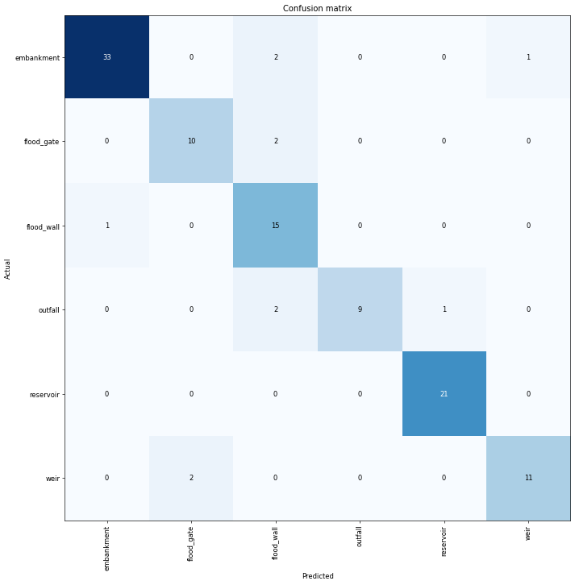
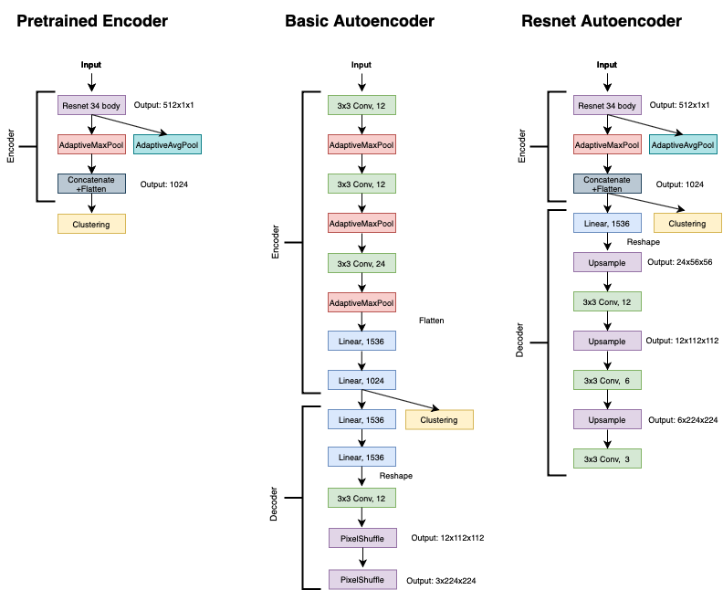
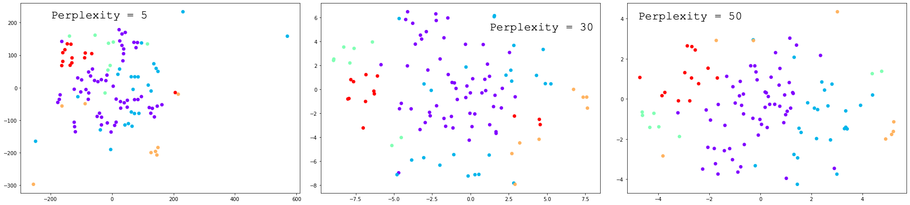
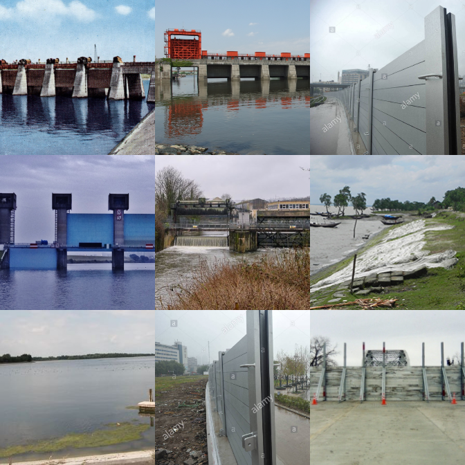

# Automatic Asset Classification
This readme has a basic overview of the project and results. A full report can be found [here](https://henriwoodcock.github.io/2020/06/07/Automatic-Asset-Classification/) on my website.

## Key Takeaways:
- Asset recognition proves high accuracy through the use of transfer learning.
- An experimental idea to allow algorithms to cluster assets to find underlying attributes to the assets.

## Contents
- [Introduction](#introduction)
- [Data](#data1)
  - [Data Collection](#data-collection)
  - [Data Cleaning](#data-cleaning)
- [Experiment and Notebooks](#experiment-and-Notebooks)
  - [Models](#models)
- [Conclusion](#conclusion)
- [References](#references)


## Introduction
This project aims to automate the task of labelling images of assets, this is done by introducing two methods, _Semi-Automatic Asset Classification_ and _Automatic Asset Classification_. Semi-Automatic Asset Classification applies modern best standards of image classification on labelled images on water assets, this provides a way to automate labelling images providing some whereas Automatic Asset Classification is an experimental idea in which an algorithm clusters images of assets. The result may not lead to assets being grouped as currently labelled but could lead to more natural groupings of assets instead of just by how humans have labelled them.

## Data
The section is going to go through the collection, cleaning and preparation of data ready for the modelling. For this experiment, images of flood and water assets were collected for analysis.

The final dataset consisted of the following categories:
- Embankments
- Flood Gates
- Flood Walls
- Outfalls
- Reservoirs
- Weirs

### Data Collection
Images for the model were collected from google images. This was done with the following technique:

1. Go to google images
2. Search your key word. For example "flood gate"
3. Go to the very bottom of the page (press load more until you cannot anymore)
4. Open the console on your web browser and enter: `urls = Array.from(document.querySelectorAll('.rg_di.rg_meta')).map(el=>JSON.parse(el.textContent).ou); window.open('data:text/csv;charset=utf-8,' + escape(urls.join('\n')));`
5. Save the CSV

This gives CSV files containing image URL links. This is an effective method for smaller datasets, however, when creating a larger dataset a web scraping algorithm for image links would be more effective.

The CSV can then be used to download images using the python package `requests`.

```python
import requests
result = requests.get(image_url, stream = True)
```

### Data Cleaning
Cleaning the images ready for use in the final model consisted of three parts: removing duplicate images, removing incorrectly labelled images (from the web scrape) and finally cropping images ready for use.

#### Removing Duplicate Images
To remove duplicate images multiple algorithms were used. The first check was to make sure images were not broken, this could be from corrupted file downloads. This was done with a `try` and `except` block in python by attempting to open all the images. With the broken images removed, the images could then be analysed for duplicates.

Algorithms used to remove duplicate images:
- Hash
- Dhash
- Hamming Distance

Code for this section can be found [here](automatic_asset_classification/web_scape)

#### Removing Incorrect Images
Removing incorrect images was done in a semi-automated fashion. For each category of image (such as Flood Wall), the first 50 or so images were labelled as a "yes" or "no" representing whether the current label for the images was correct. This was done through fine-tuning a pretrained Resnet34 model from [PyTorch](https://pytorch.org/hub/pytorch_vision_resnet/).

Once trained on the first 50 images, the model can then be used to predict whether the remaining images are correctly labelled. If the model predicted "yes" the image was kept and if "no" the image was removed.

Code for this section can also be found [here](automatic_asset_classification/web_scape)

#### Image Cleaning
After all the above processing, the dataset left is _almost_ final. The last step to prepare the data ready for use is to crop the images so that the object is centred is and so that all images are square. This is all done by hand as to avoid issues with automated algorithms centring on the wrong object arising. While doing this, images can be checked if they were correctly labelled too.

This is done to make sure that all algorithms focus on the correct object in the image (in case an image contains multiple objects). Images are squared as it means that pretrained architectures can be used.


## Experiment and Notebooks
There are two sections to this project, _Semi-Automatic Asset Classification_ and _Automatic Asset Classification_. Semi-Automatic Asset Classification is your basic image classifier and fine-tunes a Resnet 34 model. _Automatic Asset Classification_ uses unlabelled imagery to find underlying features in the images which may help find better groupings of assets.

### Semi-Automatic Asset Classification
- Fine-tuned Resnet 34 model
- An accuracy of __90%__ on unseen data.



### Automatic Asset Classification
3 Models are compared and basic overviews of the architecture can be seen below, (the code can be found [here](automatic_asset_classification) for a more indepth look.)




An example plot of one of the clustering models (dimension reduced by TSNE with varying perplexity) with an example of a cluster can be seen below.





More can be found in the [report](https://henriwoodcock.github.io/2020/06/07/Automatic-Asset-Classification/).


## Conclusion
In conclusion, this report has developed a proof of concept for the use of autoencoders in classifying flood assets. This could be extended to include assets from all domains. Semi-Automatic Asset Classification has shown that with labelled data neural networks can be trained to classify assets to a high accuracy of 90%.

With unsupervised training, this report has shown neural networks can group assets by some underlying features such as material, environment and risk. 3 models were compared for this section and a Resnet autoencoder proved to be most effective, being able to split up the asset images into more clusters leading to more underlying features. These clusters also had more clear underlying features linking the assets within them together.

Overall, a combination of both Semi-Automatic and Automatic Asset Classification could be most effective. With Semi-Automatic Asset Classification able to classify assets to their high-level labels which could be combined with Semi-Automatic Asset Classification to add more information to these assets from underlying features found between them.

One of the main drawbacks of this experiment was the size and quality of the dataset. It is hard to find high-quality images of flood assets online and perhaps if this experiment was repeated in-house at a flood defence company better results could be achieved with more clear, higher quality images and a larger set of images.

There are two clear ways to extend this experiment. One way would be to include a dataset with both high level and low-level labels leading to a supervised way to train a network to predict both high-level labels such as asset type and low-level features such as material. The other way would be to use image segmentation to develop a model which could label _all_ assets in one image instead of being limited to one asset per image.
